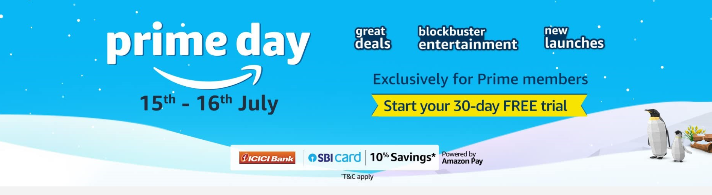
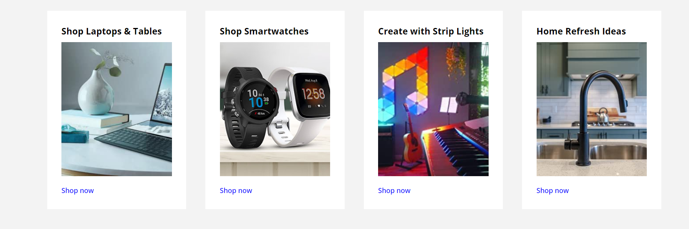
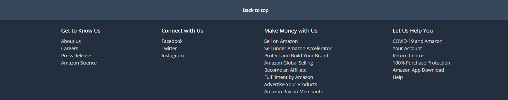

# Amazon Clone Project

This project is a clone of the Amazon website homepage, showcasing various HTML and CSS skills.

## Table of Contents
- Header Section
- Banner Section
- Hero Section
- Shop Section
- Footer Section
- Hosted Link

## Screenshots and Explanations

### Header Section
The header includes the navigation bar with a logo, address section, search bar, sign-in, returns, and cart links.

**HTML Tags Used:**
- `<header>`
- `<nav>`
- `
`
- `<a>`
- `<select>`
- `<input>`
- ``

**CSS Properties:**
- Flexbox for layout
- Background colors
- Font sizes and weights
- Padding and margins

### Banner Section
The banner includes navigation links and a special deals section.

**HTML Tags Used:**
- `
`
- `<ul>`
- `<li>`
- `<a>`

**CSS Properties:**
- Flexbox for layout
- Background colors
- Font sizes
- Padding and margins

### Hero Section
The hero section includes a large background image.

**HTML Tags Used:**
- `<section>`

**CSS Properties:**
- Background image
- Height and width settings
- Background positioning

### Shop Section
The shop section includes cards for different product categories with images and links.

**HTML Tags Used:**
- `<section>`
- `
`
- `<h3>`
- ``
- `<a>`

**CSS Properties:**
- Grid layout
- Padding and margins
- Background colors
- Hover effects

### Footer Section
The footer includes multiple columns with links.

**HTML Tags Used:**
- `<footer>`
- `
`
- `<ul>`
- `<li>`
- `<a>`
- `<h3>`

**CSS Properties:**
- Flexbox for layout
- Background colors
- Font sizes
- Padding and margins

## Hosted Link
The project is hosted at: [Amazon Clone](https://Ashudevtech.github.io/Weekly-test-5)

